# CAKE: Context-Aware Kid Emotion In-the-Wild Dataset

[[Paper]](https://ieeexplore.ieee.org/abstract/document/11557063) *The 20th IEEE International Conference on Automatic Face and Gesture Recognition (FG 2026)*

## Overview

**Context-Aware Kid Emotion (CAKE)** is a multimodal in-the-wild dataset featuring children between 4 and 12 years old in interactive social settings. The dataset contains 259 video clips from movies with diverse and rich emotion annotations:
- 12 discrete emotions
- valence-arousal scales
- textual descriptions

## Examples of Different Expressions in CAKE
<table border="1">
  <tr><td align="center" width="25%">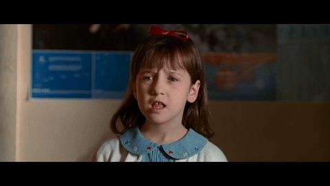</td><td align="center" width="15%"><b>Anger</b></td><td align="center" width="15%">Valence: 1 <br> &nbsp;Arousal: 5 </td><td align="left">She crumples her face, furrows her brow and scowls. Her voice is loud, she squints her entire face. She lowers her entire head in the end.</td></tr>
  <tr><td align="center" width="25%">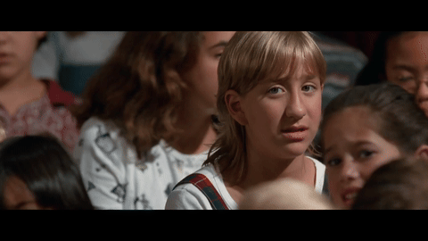</td><td align="center" width="15%"><b>Anxiety</b></td><td align="center" width="15%">Valence: 2 <br> &nbsp;Arousal: 3 </td><td align="left">The character has a small frown and lowered eyebrows indicating anxiety. Her facial expression shows worry and concern as she says "Bruce looks real bad". She has a slight frown after she finishes speaking.</td></tr>
  <tr><td align="center" width="25%">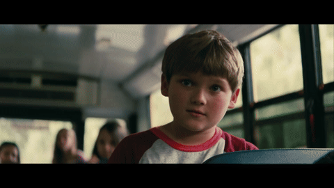</td><td align="center" width="15%"><b>Contempt</b></td><td align="center" width="15%">Valence: 3 <br> &nbsp;Arousal: 3 </td><td align="left">The character is looking straight at someone in a confrontational manner. His eyes are quite wide and stern facial features with no smiling. His tone sounds threatening and looking down shows lack of respect on someone.</td></tr>
  <tr><td align="center" width="25%">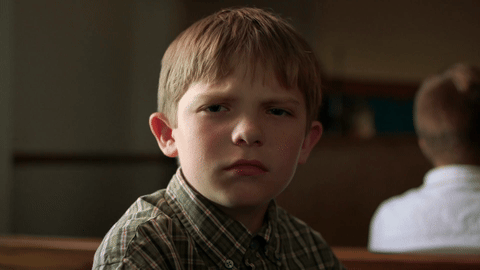</td><td align="center" width="15%"><b>Confusion</b></td><td align="center" width="15%">Valence: 2 <br> &nbsp;Arousal: 3 </td><td align="left">The character is frowning with a flat line mouth that is neither smiling nor turned downward. His eyes are still as if looking at something and trying to understand it. His facial features are expressionless and show no understanding of the current events.</td></tr>
  <tr><td align="center" width="25%">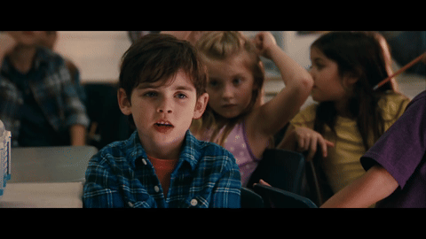</td><td align="center" width="15%"><b>Curiosity</b></td><td align="center" width="15%">Valence: 3 <br> &nbsp;Arousal: 1 </td><td align="left">He leans forward and moves his shoulders forward indicating he's leaning into the question and answer. His voice is very high pitched and he raises the tone of his voice. His gaze is focused on the other person as if waiting for a clarification.</td></tr>
  <tr><td align="center" width="25%">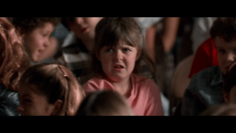</td><td align="center" width="15%"><b>Disgust</b></td><td align="center" width="15%">Valence: 1 <br> &nbsp;Arousal: 4 </td><td align="left">Mouth open and lips pulled down. Eyes narrowed and tongue sticks out showing disgust. The child grimaces and says "ew" indicating disgust.</td></tr>
  <tr><td align="center" width="25%">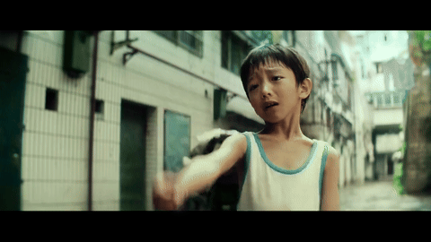</td><td align="center" width="15%"><b>Fear</b></td><td align="center" width="15%">Valence: 1 <br> &nbsp;Arousal: 4 </td><td align="left">The person's face is frowning with corners of eyes pulling down and brows pulled inwards. There are wrinkles visible on the cheeks. His raised eyebrow indicates fear. He is pointing a finger, which seems like a defence mechanism.</td></tr>
  <tr><td align="center" width="25%">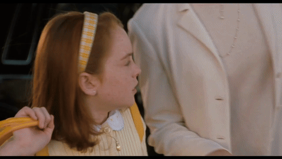</td><td align="center" width="15%"><b>Frustration</b></td><td align="center" width="15%">Valence: 2 <br> &nbsp;Arousal: 4 </td><td align="left">The character frowns and raises their eyebrows, shrug their shoulders, roll their eyes and sigh. They show frustration and make a stamping motion. They roll their eyes up toward the skies.</td></tr>
  <tr><td align="center" width="25%">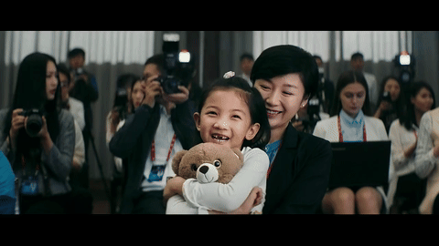</td><td align="center" width="15%"><b>Happiness</b></td><td align="center" width="15%">Valence: 5 <br> &nbsp;Arousal: 4 </td><td align="left">The child is smiling with a big smile and has happy eyebrows. She is hugging her teddy bear and shrugs happily to bring it closer.</td></tr>
  <tr><td align="center" width="25%">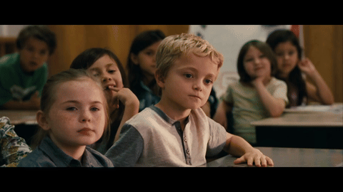</td><td align="center" width="15%"><b>Neutral</b></td><td align="center" width="15%">Valence: 3 <br> &nbsp;Arousal: 1 </td><td align="left">They do not smile or show any change in their facial expressions. They remain neutral. They are not reacting at all.</td></tr>
  <tr><td align="center" width="25%">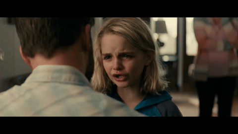</td><td align="center" width="15%"><b>Sadness</b></td><td align="center" width="15%">Valence: 1 <br> &nbsp;Arousal: 4 </td><td align="left">The character has knitted eyebrows and is frowning with their mouth turned downward at the corners. They have visible tears and red eyes with a runny nose whilst sniffing and speaking in a trembling voice. Their face is red especially their nose.</td></tr>
  <tr><td align="center" width="25%">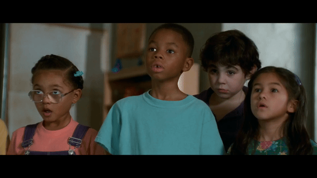</td><td align="center" width="15%"><b>Surprise</b></td><td align="center" width="15%">Valence: 3 <br> &nbsp;Arousal: 2 </td><td align="left">He appears nervous and is taking small steps while carrying objects. He looks to his side a lot and keeps looking around, searching the environment. His mouth is open, forming an O shape with the bottom lip wider, possibly gasping for air.</td></tr>
</table>

## Terms & Conditions
- This dataset is provided exclusively for **non-commercial research and academic purposes.**
- You agree **not to** copy, redistribute, republish, or transmit the dataset, in whole or in part, to any third party.
- You agree **not to** sell, trade, or exploit any video clips or derived data for commercial purposes.
- Any publication, conference paper, or research output utilizing this dataset must explicitly cite the original work.
- The authors reserve the right to terminate your access to the dataset at any time.

## How to access CAKE
*Coming Soon...*

## Citation
If you use this dataset in your research, please cite our paper:
```
@inproceedings{poovongsaroj2026cake,
  title={{CAKE}: Context-Aware Kid Emotion In-the-Wild Dataset},
  author={Poovongsaroj, Sornsiri and Zeng, Zhuo and Cummins, Nicholas and Celiktutan, Oya},
  booktitle={2026 IEEE 20th International Conference on Automatic Face and Gesture Recognition ({FG})},
  pages={1--5},
  year={2026},
  organization={IEEE}
}
```
